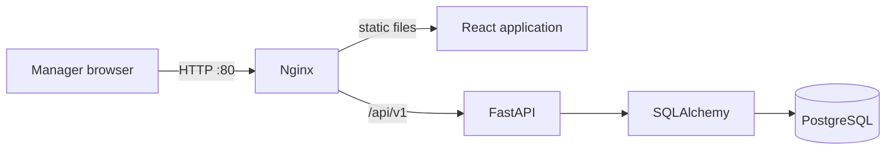
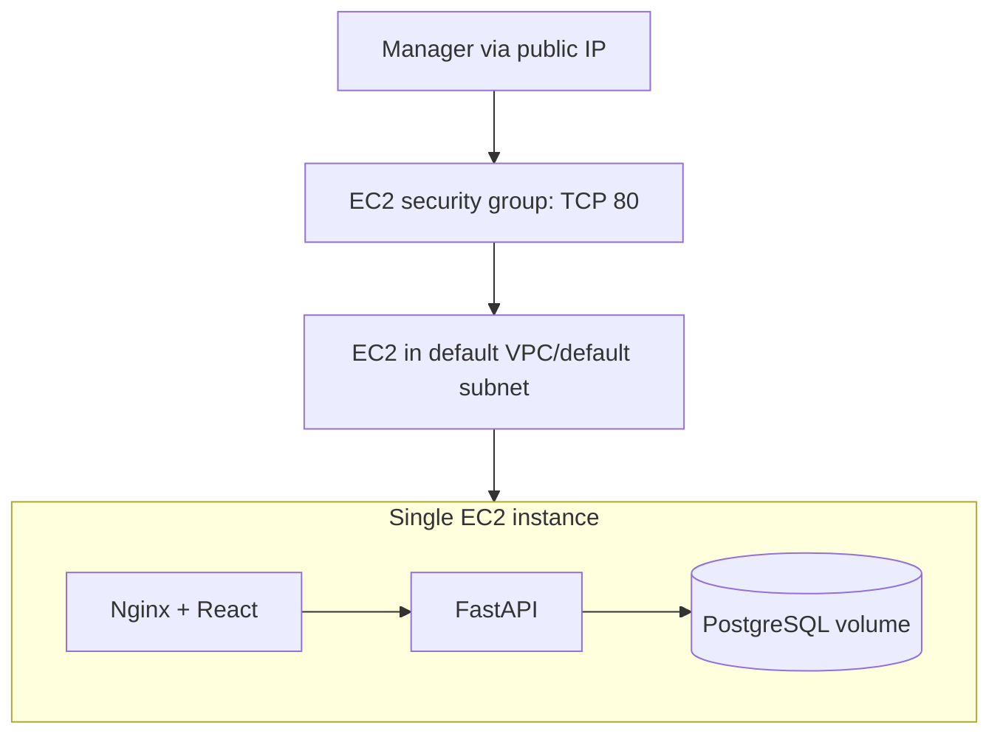

# Architecture

## Application flow

The browser holds filter UI state. FastAPI validates it and PostgreSQL performs all candidate matching. Only matching candidate summaries are returned.

## Minimal AWS deployment

Terraform uses the account's default VPC. Because this AWS account has no remaining default subnets, it creates one public subnet inside that VPC, then creates a security group, an IAM role for Systems Manager, one private S3 deployment-artifact bucket, and one EC2 instance. The bucket is only a source-transfer mechanism because this workspace has no remote Git repository; it does not participate at runtime. No custom VPC, load balancer, domain, TLS certificate, RDS, or public database port is introduced.

PostgreSQL runs on the EC2 instance because this is a simple demonstration. A longer-lived internal application should move it to RDS.
