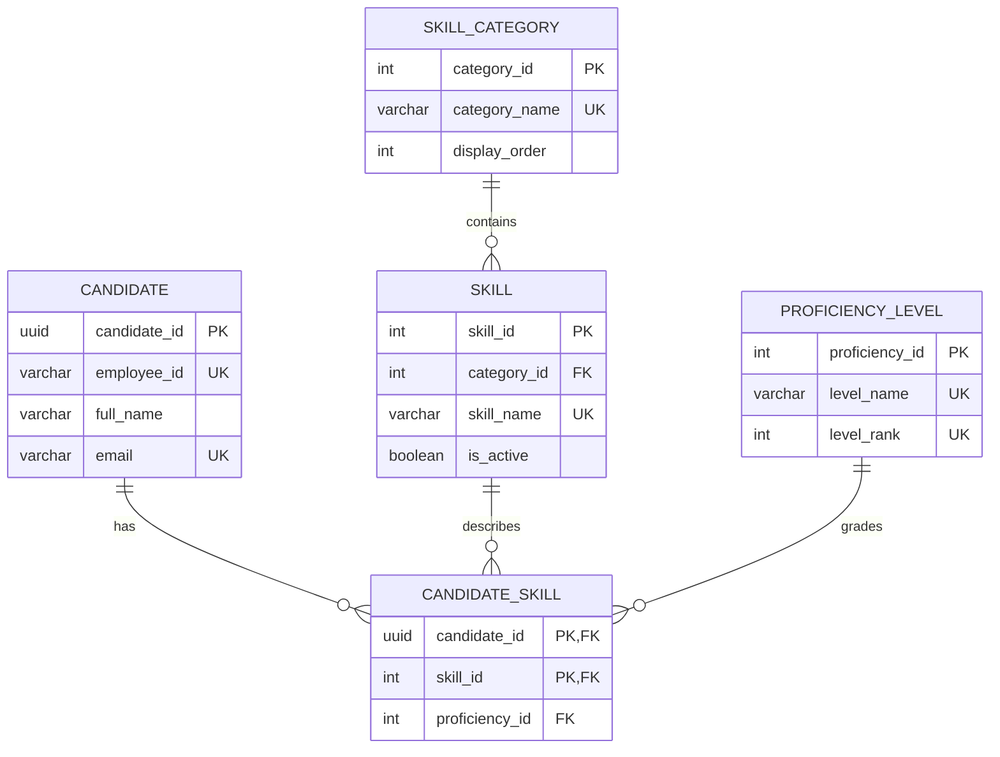

# Taxonomy and data model

## Taxonomy decision

The existing technologies are retained to keep the questionnaire short. Only their grouping is corrected. Ambiguous labels such as `Go` and `TFS/VTVS` are preserved until the form owner clarifies them.

```text
Infrastructure as Code & Configuration
├── AWS CloudFormation
├── Chef
├── OpenStack
├── Puppet
├── Azure ARM Templates
└── Packer

Source Control Management
├── Git
├── GitHub
├── TFS/VTVS
├── Bitbucket
├── AWS CodeCommit
├── Azure Repos
└── Google Cloud Source Repositories

Containers & Orchestration
├── Kubernetes (Classic)
├── ECR/EKS (AWS)
├── ACS/AKS (Azure)
├── Mesos
└── GCE/GKE (Google)

Build Management
Continuous Integration
Artifact Repository Management
Testing & QA
Deployment Automation
Monitoring & Analysis
Security
Consulting
Programming
Backend
Scripting
```

The latter groups retain exactly the technologies found in the workbook. `Statement 2` is excluded because it is not a technology. “Other … Skills” entries remain available as form labels but are not populated by synthetic seeds.

## Proficiency

| Rank | Application label | Workbook values mapped here |
|---:|---|---|
| 0 | No Exposure | Not used |
| 1 | Beginner | Beginner |
| 2 | Working Knowledge | Working |
| 3 | Advanced | Advanced |
| 4 | Expert | Expert, Mastery |

No candidate-skill row means not assessed. Rank 0 means explicitly assessed with no exposure. Normal talent searches require rank 1 or higher.

## ER diagram



The many-to-many junction is indexed by skill/proficiency/candidate so PostgreSQL can perform the core filters efficiently.
